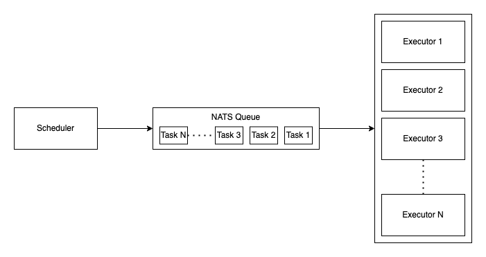

# go-task-scheduler
Distributed event-driven task scheduler and executors using Go and NATS.

## Architecture
The architecture is composed of a scheduler and multiple executors. The scheduler is responsible for receiving tasks and scheduling them to be executed by the executors. The executors are responsible for executing the tasks and reporting the results back to the scheduler. Executors are stateless and can be scaled horizontally.



## How to run
Install [docker-compose](https://docs.docker.com/compose/install/) and run the following command (replace `N` with the number of executors you want to run):
```bash
docker-compose build & docker-compose up --scale executor=N
```


