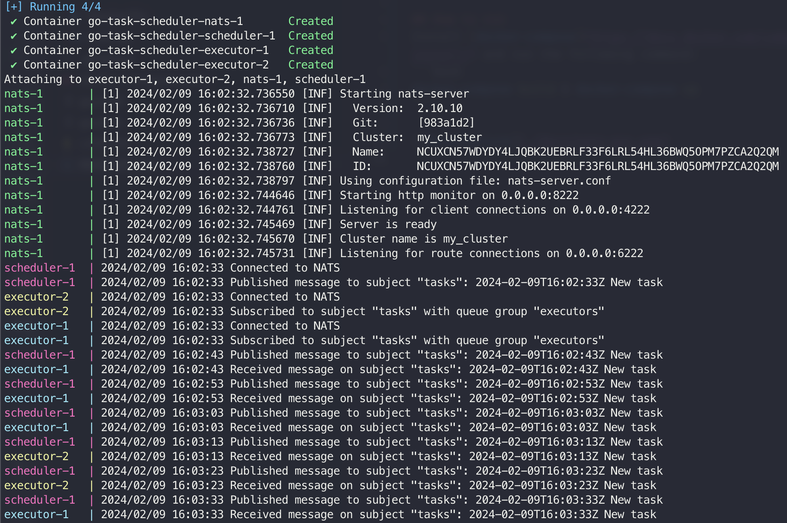

# go-task-scheduler
Distributed event-driven task scheduler and executors using Go and NATS.

## How to run
Install [docker-compose](https://docs.docker.com/compose/install/) and run the following command (replace `N` with the number of executors you want to run):
```bash
docker-compose build & docker-compose up --scale executor=N
```


